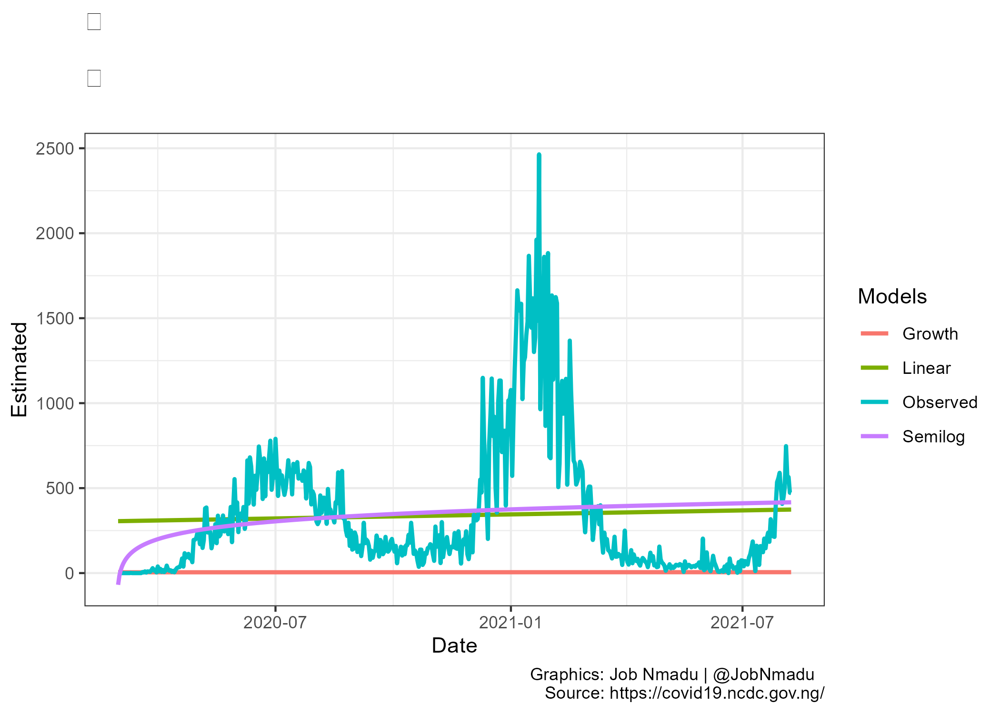
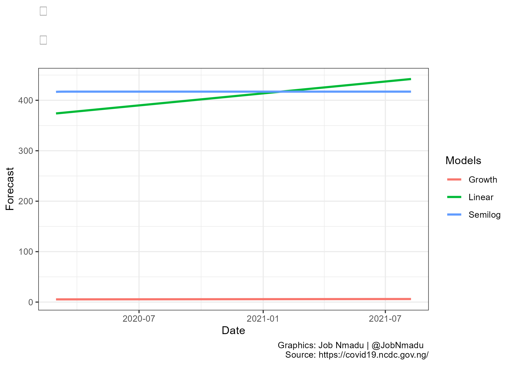

```{r setup, include=FALSE, message = FALSE, warning = FALSE}
knitr::opts_chunk$set(echo = TRUE)
```


```{r Load libraries and data, include=FALSE, message = FALSE, warning = FALSE}

options(tidyverse.quiet = TRUE)
library(tidyverse)    # main package
library(zoo)          # was used for moving average
library(gghighlight)  # for highlight specif plot at each facet
library(ggthemes)     # may be needed for specif need
library(ftplottools)  #
library(coronavirus)  # used for corona dataset
library(lubridate)     # for date manipulation
library(tidytext)      # for analyzing text data
library(scales)
library(splines)
source("docs/RegressionDiagnosis.R")
source("docs/percent function.R")
source("docs/scaled_logit.R")
theme_set(theme_minimal())  
library(readxl)

DDPtable <- read_excel("data/DDPtable.xlsx")
DDPtable$Date <- as.Date(DDPtable$Date)
rownames(DDPtable) <- NULL
niz <- read_excel("data/niz.xlsx")
rownames(niz) <- NULL
niz$Date <- as.Date(niz$Date)
options(scipen = 999, digits = 2)

Dsf <- seq(as.Date(niz$Date[length(niz$Date)] + lubridate::days(1)),
           by = "day", length.out = length(niz$Date))
day01 <- format(niz$Date[1], format = "%B %d, %Y")
daylast <- format(niz$Date[length(niz$Date)], format = "%B %d, %Y")
casesstarts <- paste("Starting from", day01, "to", daylast,
                     collapse=" ")
casesstarts1 <- paste("Number of days from", day01, "to",
                      daylast, collapse=" ")
casesstarts11 <- paste("Number of days the last COVID19 case was recorded as at", daylast, collapse=" ")
dayfo <- format(Dsf[1], format = "%B %d, %Y") # - lubridate::days(1)
dayfo2021 <- format(Dsf[1], format = "%m/%d/%Y") # - lubridate::days(1)
dayfo2021 <- as.Date(as.character(dayfo2021), format = "%m/%d/%Y")
lastdayfo <- format(Dsf[length(Dsf)], format = "%B %d, %Y")
forcaststarts <- paste("Starting from", dayfo, "to", lastdayfo,
                       collapse=" ")
```


```{r scroll bar, echo = FALSE}
gotop::use_gotop()
```


```{r echo = FALSE, message = FALSE, warning = FALSE}

png("img/numstates.png", width=1200, height=800)
plot(DDPtable$Series, DDPtable$Total, main = " ", col = "red", type = "l", lwd = 2, xlab = "Days", ylab = "Number of States")
grid(10,20,lty=1,lwd=1)
abline(v = c(30, 247, 420), lwd = 2, lty = 2, col = "black")
#lines(density(z.s$Case), lwd = 2, type = "l", col = "blue", bw = 69.22)
lines(fitted.values(smooth.spline(DDPtable$Series, DDPtable$Total)), type = "l", col = "blue", lwd = 2)
lines(fitted.values(lm(DDPtable$Total ~ bs(DDPtable$Series, knots = NULL))), type = "l", col = "yellow", lwd = 2)
lines(fitted.values(lm(DDPtable$Total ~ bs(DDPtable$Series, knots = c(30, 247, 420)))), type = "l", col = "forestgreen", lwd = 2)
lines(fitted.values(lm(Total ~ Series, data = DDPtable)), type = "l", col = "brown", lwd = 2)
lines(fitted.values(lm(Total ~ log(Series), data = DDPtable)), type = "l", col = "pink", lwd = 2)
lines(fitted.values(lm(log(Total) ~ Series, data = DDPtable)), type = "l", col = "violet", lwd = 2)
DDf <- c("Linear", "Growth", "Semilog", "Observed", "Break points", "Smooth spline", "Splines with knots", "Splines without knots") #, "Density")
legend("topright", 
       inset = c(0, 0),  bty = "n", x.intersp = 0.5,
       xjust = 0, yjust = 0,
       legend = DDf, col = c("brown", "violet", "pink", "red", "black",
                             "blue", "forestgreen", "yellow"),
       lwd = 2, cex = 2, xpd = TRUE, horiz = FALSE)

invisible(dev.off())
```


```{r echo = FALSE, message = FALSE, warning = FALSE}

Linear <-  lm(Case ~      Day, data = niz)
Semilog <- lm(Case ~      log(Day), data = niz)
Growth <-  lm(log(Case+1) ~ Day, data = niz)
Null  <- lm(Case ~ bs(Day, knots = NULL), data = niz)
Knotss <- lm(Case ~ bs(Day, knots = c(30, 247, 420)), data = niz)
Smooth  <- smooth.spline(niz$Day, niz$Case)
ARIMA  <- forecast::auto.arima(niz$Case)

Linear1 <- huxtable::huxreg("Linear" = Linear,
                         "Semilog" = Semilog,
                         "Growth" = Growth,
                         "Spline without knots" = Null,
                         "Spline with knots" = Knotss,
                         # "Smooth spline" = fit1,
                          "ARIMA" = ARIMA,
                          stars = c(`****` = 0.001, `***` = 0.01,
                            `**` = 0.05, '*' = 0.1), statistics = NULL)
```

`r Linear1`

```{r echo = FALSE, message = FALSE, warning = FALSE}

DD <- as.data.frame(niz)
Linears <- ModelSelection(Observed = DD, yvalue = DD[, 2], Model = Linear, K = 2, Name = "Linear", Form = "LM", kutuf = 0, TTy = "Number")
Semilogs <- ModelSelection(Observed = DD, yvalue = DD[, 2], Model = Semilog, K = 2, Name = "Semilog", Form = "LM", kutuf = 0, TTy = "Number")
Growths <- ModelSelection(Observed = DD, yvalue = DD[, 2], Model = Growth, K = 2, Name = "Growth", Form = "LM", kutuf = 0, TTy = "Number")
Knotsss <- ModelSelection(Observed = DD, yvalue = DD[, 2], Model = Knotss, K = 2, Name = "Knots", Form = "LM", kutuf = 0, TTy = "Number")
Nulls <- ModelSelection(Observed = DD, yvalue = DD[, 2], Model = Null, K = 2,  Name = "Nulls", Form = "LM", kutuf = 0, TTy = "Number")
Smooths <- ModelSelection(Observed = DD, yvalue = DD[, 2], Model = Smooth, K = 2,  Name = "SMOOTH", Form = "LM", kutuf = 0, TTy = "Number")
ARIMAs <- ModelSelection(Observed = DD, yvalue = DD[, 2], Model = ARIMA, K = 2,  Name = "ARIMA", Form = "LM", kutuf = 0, TTy = "Number")

SelectionCriteria <- as.data.frame(cbind("Linear" = Linears, "Semilog" = Semilogs, "Growth" = Growths, "Spline with knots" = Knotsss, "Spline without knots" = Nulls, "Smooth spline" = Smooths, "ARIMA" = ARIMAs))
XYZ <- knitr::kable(SelectionCriteria, "html")
#kableExtra::kable_styling(XYZ, "striped", position = "center")
```

`r XYZ`

```{r echo = FALSE, message = FALSE, warning = FALSE}

#png("img/numstatesFF.png")

lower = 1
upper = 37
x = fitted.values(smooth.spline(DDPtable$Series, DDPtable$Total))
zz <- scaled_logit(x = x , lower = lower, upper = upper)
SmoothF  <- forecast::forecast(zz, h = length(niz$Date))
SmoothFFi <- inv_scaled_logit(x = SmoothF$mean , lower = lower, upper = upper)

 x = fitted.values(lm(DDPtable$Total ~ bs(DDPtable$Series, knots = NULL)))
 zz <- scaled_logit(x = x , lower = lower, upper = upper)
 NullF <- forecast::forecast(zz, h = length(niz$Date))
 NullFFi <- inv_scaled_logit(x = NullF$mean , lower = lower, upper = upper)
 
 x = fitted.values(lm(DDPtable$Total ~ bs(DDPtable$Series, knots = c(30, 247, 420))))
 zz <- scaled_logit(x = x , lower = lower, upper = upper)
 KnotsF  <- forecast::forecast(zz, h = length(niz$Date))
 KnotsFFi <- inv_scaled_logit(x = KnotsF$mean , lower = lower, upper = upper)
LinearF  <- forecast::forecast(fitted.values(lm(Total ~ Series, data = DDPtable)), h = length(niz$Date))
SemilogF  <- forecast::forecast(fitted.values(lm(Total ~ log(Series), data = DDPtable)), h = length(niz$Date))
GrowthF  <- forecast::forecast(fitted.values(lm(log(Total) ~ Series, data = DDPtable)), h = length(niz$Date))

KnotsFF <- as.data.frame(cbind("Date" = Dsf, "Day" = niz$Day, "Smooth spline" = SmoothFFi, "Splines without knots" = NullFFi,  "Splines with knots" = KnotsFFi, Linear = LinearF[["mean"]], Semilog = SemilogF[["mean"]], Growth = GrowthF[["mean"]]))

KnotsFF$Date <- as.Date(KnotsFF$Date)

KnotsFF1 <- KnotsFF %>%
   pivot_longer(-c(Date, Day), names_to = "Models",
                values_to = "Forecast")
KnotsFF1$Date <- as.Date(KnotsFF1$Date) 

plotgga <- ggplot(KnotsFF1) +
   aes(x = Date, y = Forecast, colour = Models, group = Models) +
   geom_line(size = 1L) +
   scale_color_hue() +
   theme_bw() +
   labs(title = "\n  \n",
        subtitle = " ",
        caption = "Graphics: Job Nmadu | @JobNmadu  \n Source: https://covid19.ncdc.gov.ng/")
ggsave("img/numstatesFF.png", plot = plotgga)

#invisible(dev.off())
```


```{r echo = FALSE, message = FALSE, warning = FALSE}

library("performance")
BREAKS <- c(70, 131, 173, 228, 274, 326, 375, 460)

fit0  <- lm(Case ~ bs(Day, knots = NULL), data = niz)
fit0f <- fitted.values(fit0)
fit   <- lm(Case ~ bs(Day, knots = BREAKS), data = niz)
fitf  <- fitted.values(fit)
fit1  <- smooth.spline(niz$Day, niz$Case)
fit1f <-  fitted.values(fit1)
fita  <- forecast::auto.arima(niz$Case)
fitaf <- fita[["fitted"]]
fitpi <- lm(Case ~ Day + I(Day^2), data = niz)
fitpif <- fitted.values(fitpi)
RMSE <- c('Without knots' = performance_rmse(fit0),
'Smooth Spline'           = performance_rmse(fit1),
'With knots'              = performance_rmse(fit),
'Polynomial'              = performance_rmse(fitpi),
'Lower ARIMA'             = performance_rmse(fita),
'Upper ARIMA'             = performance_rmse(fita))

#RMSE <- 1/RMSE
RMSE_weight <- as.list(RMSE / sum(RMSE))
P_weight <- (fitted.values(fit0)   * RMSE_weight$`Without knots`) +
            (fitted.values(fit1)  * RMSE_weight$`Smooth Spline`) +
            (fitted.values(fit)  * RMSE_weight$`With knots`) +
            (fitted.values(fitpi) * RMSE_weight$Polynomial) +
            (fita[["fitted"]]     * RMSE_weight$`Lower ARIMA`)

kk30 <-  (fitf + fit0f + fit1f + fitpif + fitaf)/5
kk40 <- lm(Case~fitf * fit0f * fit1f * fitpif * fitaf, data = niz)
kk60 <- lm(Case~fitf + fit0f + fit1f + fitpif + fitaf, data = niz)

#z <- ts(niz$Case, start = c(2020,2,29), frequency = 7, end=c(2021,1,11))
#zforecasts <- HoltWinters(z)
```


```{r echo = FALSE, message = FALSE, warning = FALSE}

svglite::svglite("img/state07.svg", width = 14, height = 10)

plot(niz$Day, fitted.values(fit), main = " ",
     col = "red", type = "l", lwd = 2,
     xlab = casesstarts,
     ylab = "COVID-19 confirmed cases")
lines(fitted.values(fit), col="red",lwd=2)
grid(10,20,lty=1,lwd=1)
lines(niz$Case, col="brown")
lines(fitted.values(fit0), col = "blue", lwd = 2)
lines(fitted.values(fit1), col = "cyan", lwd = 2)
lines(fita[["fitted"]], col = "yellow", lwd = 2)
lines(fitted.values(fitpi), col = "skyblue", lwd = 2)
lines(kk30, col="green")
lines(fitted.values(kk40), col = "purple", lwd = 2)
lines(fitted.values(kk60), col = "magenta", lwd = 2)
lines(P_weight, col="darkorange")

#adding cutpoints
abline(v = BREAKS, lwd = 2, lty = 2, col = "black")
DDf <- c("Observed", "Spline-with knots", 
         "Spline-without knots", "Smooth Spline",
         "ARIMA", "Polynomial", "Essembled with equal weight",
         "Essembled based on weight", "Essembled based on summed weight",
         "Essembled based on weight of fit", "Cut points")

legend("topleft", 
       inset = c(0, 0),  bty = "n", x.intersp = 0.5,
       xjust = 0, yjust = 0,
       legend = DDf, col = c("brown", "red", "blue", "cyan",
                             "yellow", "skyblue", "green", "purple",
                             "magenta", "darkorange", "black"),
       lwd = 2, cex = 0.75, xpd = TRUE, horiz = FALSE)

invisible(dev.off())
```


```{r echo = FALSE, message = FALSE, warning = FALSE}

FITS <- huxtable::huxreg("Spline without knots" = fit0,
                         "Spline with knots" = fit,
                         # "Smooth spline" = fit1,
                          "ARIMA" = fita,
                          "Quardratic polynomial" = fitpi,
                         "Essembled based on weight" = kk40, 
                         "Essembled based on summed weight" = kk60,
                  stars = c(`****` = 0.001, `***` = 0.01,
                            `**` = 0.05, '*' = 0.1),
                  statistics = NULL)
```

`r FITS`

```{r echo = FALSE, message = FALSE, warning = FALSE}

DD <- as.data.frame(niz)
'Spline with knots' <- ModelSelection(Observed = DD, yvalue = DD[, 2], Model = fit, K = 2, Name = "Nil", Form = "LM", kutuf = 0, TTy = "Number")
'Spline without knots' <- ModelSelection(Observed = DD, yvalue = DD[, 2], Model = fit0, K = 2,  Name = "Nil", Form = "LM", kutuf = 0, TTy = "Number")
'Smooth spline' <- ModelSelection(Observed = DD, yvalue = DD[, 2], Model = fit1, K = 2,  Name = "SMOOTH", Form = "LM", kutuf = 0, TTy = "Number")
ARIMA <- ModelSelection(Observed = DD, yvalue = DD[, 2], Model = fita, K = 2,  Name = "ARIMA", Form = "LM", kutuf = 0, TTy = "Number")
'Quardratic polynomial' <- ModelSelection(Observed = DD, yvalue = DD[, 2], Model = fitpi, K = 2,  Name = "QUADRATIC", Form = "LM", kutuf = 0, TTy = "Number")
'Essembled equal weight' <- ModelSelection(Observed = DD, yvalue = DD[, 2], Model = kk30, K = 2, Name = "Values", Form = "N-LM", kutuf = 0, TTy = "Number")
'Essembled on weight' <- ModelSelection(Observed = DD, yvalue = DD[, 2], Model = kk40, K = 2, Name = "EssemWet", Form = "LM", kutuf = 0, TTy = "Number")
'Essembled summed weight' <- ModelSelection(Observed = DD, yvalue = DD[, 2], Model = kk60, K = 2, Name = "Nil", Form = "LM", kutuf = 0, TTy = "Number")
'Essembled weight of fit' <- ModelSelection(Observed = DD, yvalue = DD[, 2], Model = P_weight, K = 2, Name = "Values", Form = "N-LM", kutuf = 0, TTy = "Number")
SelectionCriteria <- as.data.frame(cbind(`Spline with knots`, `Spline without knots`, `Smooth spline`, ARIMA, `Quardratic polynomial`,`Essembled equal weight`, `Essembled on weight`, `Essembled summed weight`, `Essembled weight of fit` ))
XYZ <- knitr::kable(SelectionCriteria, "html")
#kableExtra::kable_styling(XYZ, "striped", position = "center")
```

`r XYZ`

```{r echo = FALSE, message = FALSE, warning = FALSE, eval = FALSE}

library(gridExtra)
pdf("docs/Selection.pdf")
aXYZ <- knitr::kable(SelectionCriteria, format = "pipe", padding = 0)
asas <- kableExtra::kable_styling(aXYZ, "striped")
grid.table(asas)
```


```{r echo = FALSE, message = FALSE, warning = FALSE, eval = FALSE}

compare_performance(fit0, fit, fita, fitpi, rank = TRUE)
plot(compare_performance(fit0, fit, fit1, fita, fitpi, rank = TRUE))
compare_performance(fit0, fit, fit1, fita, fitpi)
check_model(fitpi)

```


```{r echo = FALSE, message = FALSE, warning = FALSE}

 kk  <- forecast::forecast(fitted.values(fit), 
                           h = length(niz$Date))
 kk0 <- forecast::forecast(fitted.values(fit0),
                           h = length(niz$Date))
 kk1 <- forecast::forecast(fitted.values(fit1),
                           h = length(niz$Date))
 kk10 <- forecast::forecast(fitted.values(fitpi),
                            h = length(niz$Date))
 kk2 <- forecast::forecast(fita, h = length(niz$Date))
 kk31 <- forecast::forecast(kk30, h = length(niz$Date))
 kk41 <- forecast::forecast(fitted.values(kk40),
                            h = length(niz$Date))
 kk61 <- forecast::forecast(fitted.values(kk60),
                            h = length(niz$Date))
 
 KK <- as.data.frame(cbind("Date" = niz$Date,"Day" = niz$Day, "Without Knots" = kk0[["mean"]], "Smooth spline" = kk1[["mean"]],  "With Knots" = kk[["mean"]], "Polynomial" = kk10[["mean"]], "Lower ARIMA" = kk2[["lower"]], "Upper ARIMA" = kk2[["upper"]]))

 KK <- KK[,-c(7,9)]
names(KK) <- c("Date", "Day", "Without Knots", "Smooth spline", "With Knots", "Polynomial", "Lower ARIMA", "Upper ARIMA") 

WK   <- sum(KK$`Without Knots`)
WKs  <- sum(KK$`With Knots`)   
SMsp <- sum(KK$`Smooth spline`)
LA   <- sum(KK$`Lower ARIMA`)  
UA   <- sum(KK$`Upper ARIMA`)  
POL  <- sum(KK$Polynomial)

KK$Date <- as.Date(KK$Date)

DDf <- c("Without knots", "Smooth Spline", 
          "With knots", "Quadratic Polynomial",
         "Lower ARIMA", "Upper ARIMA",
         "Essembled with equal weight",
         "Essembled based on weight",
         "Essembled based on summed weight",
         "Essembled based on weight of fit" )
```


```{r echo = FALSE, message = FALSE, warning = FALSE}

KK$`Essembled with equal weight` <- kk31[["mean"]]
KK$`Essembled based on weight` <- kk41[["mean"]]
KK$`Essembled based on summed weight` <- kk61[["mean"]]
ESS  <- sum(KK$`Essembled with equal weight`)
ESM  <- sum(KK$`Essembled based on weight`)
ESMS  <- sum(KK$`Essembled based on summed weight`)

kk51 <- forecast::forecast(P_weight, h = length(niz$Date))
KK$`Essembled based on weight of fit` <-
  kk51[["mean"]]
ESF  <- sum(KK$`Essembled based on weight of fit`)
RMSE$`Essembled with equal weight` <- ModelMetrics::rmse(niz$Case, kk30)
RMSE$`Essembled based on weight` <- performance_rmse(kk40)
RMSE$`Essembled based on summed weight` <- performance_rmse(kk60)
RMSE$`Essembled based on weight of fit` <- ModelMetrics::rmse(niz$Case, P_weight)
Forcasts <- colSums(KK[,-c(1,2)])
RMSE_f <- as.data.frame(cbind("Model" = DDf,
                              "Confirmed cases" =
                                comma(round(Forcasts, 0))))

ForecastontheLastDay <- as.data.frame(t(KK[length(KK$Date), c(3:12)]))
ForecastontheLastDay <- cbind(DDf, ForecastontheLastDay)
names(ForecastontheLastDay) <- c("Model", "Forecast")
ForecastontheLastDay <- ForecastontheLastDay[order(-ForecastontheLastDay$Forecast),]
ForecastontheLastDay$Model <- factor(ForecastontheLastDay$Model, levels = ForecastontheLastDay$Model)
```


```{r echo = FALSE, message = FALSE, warning = FALSE}

svglite::svglite("img/state08.svg", width = 10, height = 7)
plot(KK$Day, KK$`Without Knots`, main = " ",
      col = "red", type = "l", lwd = 2,
      xlab = forcaststarts,
      ylab = "COVID-19 daliy forecast")
 grid(10,20,lty=1,lwd=1)
 lines(KK$`Smooth spline`, col = "blue", lwd = 2)
 lines(KK$`With Knots`, col = "cyan", lwd = 2)
 lines(KK$Polynomial, col = "skyblue", lwd = 2)
 lines(KK$`Lower ARIMA`, col = "green", lwd = 2)
 lines(KK$`Upper ARIMA`, col = "yellow", lwd = 2)
 lines(KK$`Essembled with equal weight`, col = "orange",
       lwd = 2)
 lines(KK$`Essembled based on weight`, 
       col = "black", lwd = 2)
 lines(KK$`Essembled based on weight of fit`,
       col = "pink", lwd = 2)
 legend("bottomleft", 
        inset = c(0, 0),  bty = "n", x.intersp = 0.5,
        xjust = 0, yjust = 0,
        legend = DDf, col = c("red", "blue", "cyan",
                              "skyblue", "green",
                            "yellow",  "orange",
                            "black", "pink"),
        lwd = 2, cex = 0.75, xpd = TRUE, horiz = FALSE)
 
 invisible(dev.off())
```


```{r echo = FALSE, message = FALSE, warning = FALSE}
svglite::svglite("img/state09.svg", width = 10, height = 7)
 
KK1 <- KK %>%
   pivot_longer(-c(Date, Day), names_to = "Models",
                values_to = "Forecast")
KK1$Date <- as.Date(KK1$Date) 

 ggplot(KK1) +
   aes(x = Date, y = Forecast, colour = Models, group = Models) +
   geom_line(size = 1L) +
   scale_color_hue() +
   theme_bw() +
   labs(title = "\n  \n",
        subtitle = " ",
        caption = "Graphics: Job Nmadu | @JobNmadu  \n Source: https://covid19.ncdc.gov.ng/")
 
 invisible(dev.off())
```


```{r echo = FALSE, message = FALSE, warning = FALSE}

Linear <-  lm(Case ~      Day, data = niz)
Semilog <- lm(Case ~      log(Day), data = niz)
Growth <-  lm(log(Case+1) ~ Day, data = niz)

Linear1 <- huxtable::huxreg("Linear" = Linear,
                         "Semilog" = Semilog,
                         "Growth" = Growth,
                          stars = c(`****` = 0.001, `***` = 0.01,
                            `**` = 0.05, '*' = 0.1), statistics = NULL)

Linear2 <- as.data.frame(cbind("Date" = niz$Date, "Observed" = niz$Case, "Linear" = fitted.values(Linear), "Semilog" = fitted.values(Semilog),  "Growth" = fitted.values(Growth)))
Linear2$Date <- as.Date(Linear2$Date)

Linear21 <- Linear2 %>%
   pivot_longer(-Date, names_to = "Models",
                values_to = "Estimated")
Linear21$Date <- as.Date(Linear21$Date) 

 LinearG <- ggplot(Linear21) +
   aes(x = Date, y = Estimated, colour = Models, group = Models) +
   geom_line(size = 1L) +
   scale_color_hue() +
   theme_bw() +
   labs(title = "\n  \n",
        subtitle = " ",
        caption = "Graphics: Job Nmadu | @JobNmadu  \n Source: https://covid19.ncdc.gov.ng/")
 
 ggsave("img/LinearG.png", plot = LinearG)
 
 LinearF  <- forecast::forecast(fitted.values(Linear), 
                           h = length(niz$Date))
 SemilogF <- forecast::forecast(fitted.values(Semilog),
                           h = length(niz$Date))
 GrowthF  <- forecast::forecast(fitted.values(Growth),
                           h = length(niz$Date))
 
LinearFF <- as.data.frame(cbind("Date" = niz$Date,"Day" = niz$Day, "Linear" = LinearF[["mean"]], "Semilog" = SemilogF[["mean"]],  "Growth" = GrowthF[["mean"]]))
LinearFF$Date <- as.Date(LinearFF$Date)

LinearFF1 <- LinearFF %>%
   pivot_longer(-c(Date, Day), names_to = "Models",
                values_to = "Forecast")
LinearFF1$Date <- as.Date(LinearFF1$Date) 

 LinearG1 <- ggplot(LinearFF1) +
   aes(x = Date, y = Forecast, colour = Models, group = Models) +
   geom_line(size = 1L) +
   scale_color_hue() +
   theme_bw() +
   labs(title = "\n  \n",
        subtitle = " ",
        caption = "Graphics: Job Nmadu | @JobNmadu  \n Source: https://covid19.ncdc.gov.ng/")
ggsave("img/LinearG1.png", plot = LinearG1)
```

`r Linear1`

  


